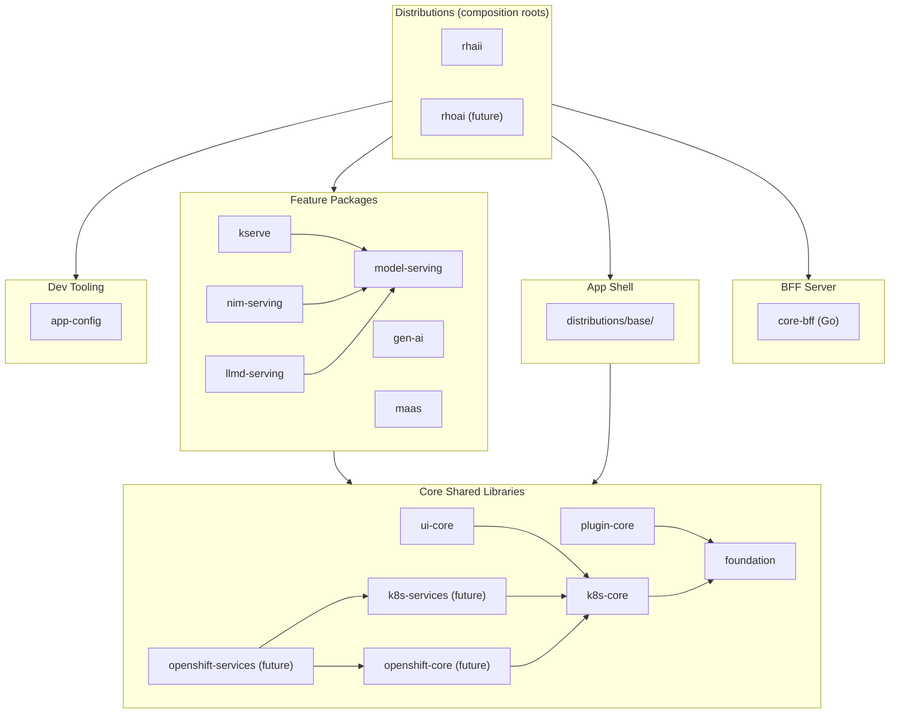
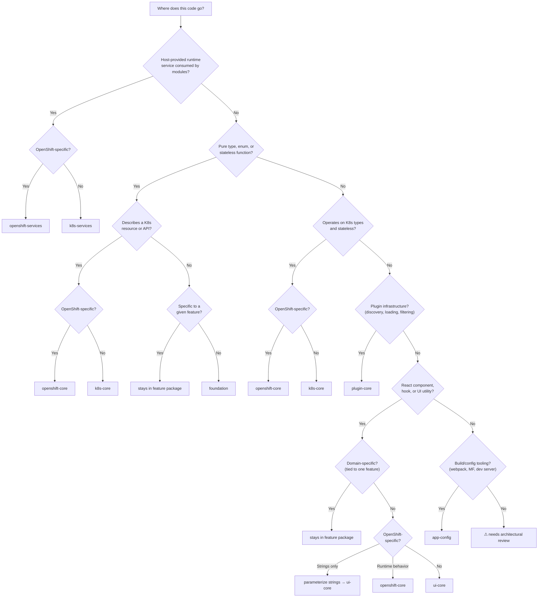

# Package Topology and Import Rules

Rules governing the dependency hierarchy and import boundaries for all packages in the
ODH Dashboard monorepo.

> **Aligned**: July 2, 2026. Attendees: Andy Stoneberg, Christian Vogt,
> Lucas Fernandez Aragon, Andrew Ballantyne, Paulo Rego.

---

## 1. Distributions Code Organization

The distributions architecture organizes code into the following groups:

| Group | What lives here | Packages |
|-------|-----------------|----------|
| **Distributions** | Concrete, deployable dashboard variants. Composition roots that wire everything together. | `distributions/rhaii/`, `distributions/rhoai/` (future) |
| **BFF Server** | Go backend-for-frontend that serves the app shell. | `distributions/core-bff/` |
| **App shell** | Shared framework (masthead, sidebar, routing, error boundary) that distributions extend. | `distributions/base/` |
| **Feature packages** | Domain-specific frontend functionality. Depend on core shared libraries. | `model-serving`, `kserve`, `gen-ai`, `maas`, `model-registry`, etc. |
| **Core shared libraries** | Extension framework, host service contracts, shared UI, K8s types, pure utilities. | `plugin-core`, `k8s-services` (future), `openshift-services` (future), `ui-core`, `k8s-core`, `openshift-core` (future), `foundation` |
| **Dev tooling** | Build-time tooling: webpack configuration, Module Federation setup, dev server infrastructure. | `app-config` |

The diagram below shows how these groups relate — arrows point from consumer to
dependency, and runtime dependencies flow downward:

---

## 2. Import Rules

### Rule 1: Layer boundary

Feature packages may depend on core shared libraries. They must not depend on the app
shell or on distributions. Core shared libraries must not depend on feature packages.

### Rule 2: Cross-feature imports

Feature packages integrate with each other in three ways, ordered from most to least
preferred:

1. **Type-only imports** — always permitted. `import type { ... }` is erased at
   compile time and creates no runtime dependency or bundle impact.

2. **Extension points** — the preferred runtime integration. Features register and
   consume extensions through the plugin store with no source-level dependency between
   packages.

3. **Direct runtime imports within a hub-and-spoke family** — permitted when:
   - The dependency is declared in `package.json` `dependencies`
   - The dependency is declared in the Module Federation shared config
   - Direction is spoke-to-hub only (hub must not import from spokes)

Direct runtime imports between feature packages outside a hub-and-spoke family are
not permitted.

### Rule 3: Domain-scoped shared packages

A domain-scoped shared package is justified when a feature package needs runtime
access to domain-specific code from another feature that it does not require to be
available.

When all consumers require the source feature to be available (as in a hub-and-spoke
group), they should import directly from that feature package.

---

## 3. The Serving Hub-and-Spoke

Model serving and its related packages follow a hub-and-spoke pattern. Model-serving
is the hub; `kserve`, `nim-serving`, and `llmd-serving` are spokes.

Every spoke declares `reliantAreas` targeting model-serving areas and registers zero
standalone routes — all extensions target model-serving extension points. The dependency
is purely unidirectional: spokes depend on the hub, the hub has zero dependencies on
spokes.

This is the only group of feature packages with direct runtime imports across features
today. Other feature packages integrate through type-only imports or extension points,
neither of which creates a runtime dependency.

---

## 4. Enforcement

The existing `import/no-extraneous-dependencies` ESLint rule catches undeclared
dependencies. Automated enforcement of layer and import direction rules is a separate
effort. PR reviewers enforce these rules using this document as reference.

---

## 5. Core Library Stack

| Package | Litmus test | Scope |
|---------|-------------|-------|
| **foundation** | "Is it a pure type or generic utility with no framework dependency?" | Pure TypeScript types and stateless utilities (e.g., `genRandomChars`). Zero `@odh-dashboard/*` runtime deps. |
| **k8s-core** | "Does it describe a K8s resource type or domain-specific utility?" | K8s resource types and stateless utilities that operate on them. No React dependency. |
| **openshift-core** | "Is it an OpenShift-specific type or runtime behavior?" | OpenShift-specific types and utilities that layer on top of `k8s-core`. |
| **plugin-core** | "Does it define the extension and discovery contract between host and modules?" | Extension points, plugin store, discovery hooks (`useExtensions`, `useResolvedExtensions`), code ref resolution (`LazyCodeRefComponent`), feature areas (`SupportedArea`, `useIsAreaAvailable`). |
| **k8s-services** (future) | "Is it a platform-neutral runtime service the host provides and modules consume?" | React contexts and hooks that bridge host-provided runtime services (K8s CRUD, configuration, access reviews, namespace resolution) to federated modules. Defines the service contract — not the implementations. Must work on any K8s cluster (OpenShift and non-OpenShift). See [§ 5.1](#51-k8s-services-and-openshift-services). |
| **openshift-services** | "Is it an OpenShift-specific runtime service the host provides and modules consume?" | Same pattern as `k8s-services` but for service contracts that require OpenShift APIs (Routes, Projects, DSC/DSCI, OpenShift OAuth). Not available on non-OpenShift distributions (e.g., RHAII). See [§ 5.1](#51-k8s-services-and-openshift-services). |
| **ui-core** | "Does it just render data using shared UI patterns?" | Shared React components (tables, resource display, form helpers), shared utilities (formatting, validation), and extension renderers (`ExtensibleDetailTabs`, `ExtensibleActions`). |
| **app-config** | "Does it run only at build time?" | Build-time tooling: webpack configuration, Module Federation setup, dev server infrastructure. If it runs in the browser at runtime, it does not belong here. |

### Where does this code go?

Use the decision flow below when extracting code from `@odh-dashboard/internal` or
deciding where new shared code belongs:

### 5.1 k8s-services and openshift-services

These two packages form the bridge between the host application and federated modules
for runtime services. They exist because federated modules need to call host-level
operations (K8s CRUD, configuration fetching, access reviews) but must not import host
internals directly.

**Interim state:** The host service contract currently lives in `plugin-core`
(introduced by the host-api bridge work). When `k8s-services` is created as a
standalone package, the contract will be extracted from `plugin-core` and consumers
will be re-pointed. Until then, `plugin-core` is the temporary home.

They are split along platform lines because the monorepo supports multiple
distributions, not all of which run on OpenShift. The RHAII distribution, for example,
runs on vanilla Kubernetes without OpenShift APIs. A shared feature package that
depends only on `k8s-services` is portable across all distributions. A package that
also depends on `openshift-services` is inherently OpenShift-specific and will not be
loaded by non-OpenShift distributions.

**Terminology — "host" and "host-provided runtime service":**

The **host** is the main dashboard application — `frontend/src/` and
`distributions/base/`. It is the code that boots in the browser, owns the React
component tree, creates the K8s API clients, holds the redux store, manages the
provider hierarchy, and loads federated modules into its tree via Module Federation.

Federated modules (`packages/*`) run inside the host's React tree but are built and
bundled independently. They do not have their own K8s clients or redux stores.

A **host-provided runtime service** is a function or piece of state that originates
in the host and is made available to federated modules through a React context bridge
rather than through direct source imports. Examples: creating a secret, performing an
access review, fetching the dashboard config CR, resolving the dashboard namespace.
`k8s-services` and `openshift-services` define the *contract* (types, contexts,
consumer hooks); the host provides the *implementations*.

#### k8s-services

Platform-neutral service contracts that work on any Kubernetes cluster.

**What belongs here:**

- React contexts that define platform-neutral service contracts between host and modules
- Consumer hooks that read from those contexts (e.g., `useHostApi`, `useSecretOps`,
  `useDashboardNamespace`, `useAccessReview`)
- Type definitions for the service contract (e.g., `HostApiServices`, `SecretOps`)

**Examples of services:** Secret CRUD, SubjectAccessReview, PVC management, dashboard
config CR fetching, namespace resolution.

**What does not belong here:**

- The service *implementations* — those stay in the host (`frontend/src/`) and are
  wired in via context providers (e.g., `HostApiProvider` in `App.tsx`)
- OpenShift-specific service contracts — those belong in `openshift-services`
- Pure K8s types or stateless utilities — those belong in `k8s-core`
- Plugin infrastructure (extension points, discovery) — that belongs in `plugin-core`
- UI components or rendering logic — that belongs in `ui-core`

**Dependencies:** `k8s-services` depends on `k8s-core` (for the K8s types used in
service signatures) and `foundation`. It peer-depends on `react`. It must not depend
on `plugin-core`, `ui-core`, `openshift-core`, or any feature package.

#### openshift-services

OpenShift-specific service contracts that layer on top of `k8s-services`.

**What belongs here:**

- React contexts and hooks for OpenShift-specific host services
- Type definitions for OpenShift-specific service contracts

**Examples of services:** Route creation, OpenShift Project management (as distinct
from K8s Namespaces), DSC/DSCI queries, OpenShift OAuth interactions.

**What does not belong here:**

- Platform-neutral services — those belong in `k8s-services`
- OpenShift types or stateless utilities — those belong in `openshift-core`
- Service implementations — those stay in the host

**Dependencies:** `openshift-services` depends on `k8s-services` (to extend the
platform-neutral contract), `openshift-core` (for OpenShift types used in service
signatures), and `foundation`. It peer-depends on `react`. It must not depend on
`plugin-core`, `ui-core`, or any feature package.

#### Why two packages instead of one

The dependency declaration in a feature package's `package.json` is itself
documentation of platform requirements:

- A package that depends on `k8s-services` alone is portable — it works on RHOAI,
  ODH, RHAII, and any future distribution regardless of cluster platform.
- A package that also depends on `openshift-services` is OpenShift-specific — it
  will not be loaded by non-OpenShift distributions like RHAII.

If service contracts were in a single package, a non-OpenShift distribution would
need to stub or no-op the OpenShift-specific services — creating runtime dead
weight and potential runtime errors if a module accidentally calls a stubbed service.
The split makes platform coupling visible at the package boundary rather than hidden
inside a provider implementation.

This mirrors the `k8s-core` / `openshift-core` split one layer down: types and
stateless utilities split by platform at the types layer, service contracts split by
platform at the services layer.

#### Why not part of another core library

- **Not k8s-core**: k8s-core has no React dependency and contains only types and
  stateless functions. The services packages use `React.createContext`, hooks, and
  `useMemo` — adding React to k8s-core would change its fundamental character.
- **Not ui-core**: ui-core is the rendering layer. Every context in ui-core today is
  presentation plumbing (notifications, analytics, theming). Service contracts define
  K8s operation contracts (`createSecret`, `checkAccess`, `getDashboardPvcs`) that
  have nothing to do with rendering. Mixing them would erode ui-core's identity as a
  standalone rendering toolkit.
- **Not plugin-core**: plugin-core is the extension and discovery system. While the
  service bridge is conceptually adjacent (both define host-module contracts), the two
  have different evolution pressures — plugin-core grows when new integration patterns
  emerge, while the services packages grow every time a package is decoupled from
  `@odh-dashboard/internal` and needs another host operation bridged.

#### Pattern

The host defines provider components (e.g., `HostApiProvider`) that wire real
implementations into the contexts. Feature modules consume services through hooks
exported from `k8s-services` (and `openshift-services` where needed), never through
direct imports from the host. Pure async functions that need host services but cannot
call hooks (because they are outside the React tree) receive the operations as
parameters — the calling hook obtains them from context and threads them through.

Each distribution's provider hierarchy determines which service contexts are
available. An OpenShift distribution provides both `k8s-services` and
`openshift-services` contexts. A non-OpenShift distribution provides only
`k8s-services` — any module that depends on `openshift-services` is simply not
loaded.

### plugin-core vs ui-core

These packages serve distinct roles in the architecture:

- **plugin-core** — the extension and discovery system. It answers: *"what features
  are installed, are they enabled, and how do I connect to them?"* Responsibilities
  include extension point type definitions, the plugin store, discovery hooks
  (`useExtensions`, `useResolvedExtensions`), code ref resolution, and feature areas
  (`SupportedArea`, `useIsAreaAvailable`).
  - `LazyCodeRefComponent` belongs here — it bridges the plugin store to a rendered
    component and is consumed directly by `distributions/base/`.

- **ui-core** — the component catalog. It answers: *"how do I render this data in a
  standard way?"* Responsibilities include shared React components (tables, resource
  display, form helpers), shared utilities (formatting, validation), and extension
  renderers.
  - `ExtensibleDetailTabs` belongs here — it consumes extension data but its job is
    rendering PatternFly layout.

Distributions depend on plugin-core to wire up extensions but have no need for shared
UI components. Feature packages that render data typically depend on both.

### plugin-core vs k8s-services

Both define contracts between the host and federated modules, but they serve different
concerns:

- **plugin-core** answers: *"what is available and how do I discover it?"* — extension
  points, feature areas, plugin store queries. It is about **capability discovery**.

- **k8s-services** (and **openshift-services**) answers: *"how do I call host-provided
  operations at runtime?"* — K8s CRUD, configuration fetching, access reviews, namespace
  resolution. It is about **runtime service consumption**.

A federated module uses plugin-core to find out *what it can do* and the services
packages to *actually do it*.

---

## 6. Platform Neutrality

Core shared libraries must be **platform-neutral at runtime** unless explicitly scoped
to a platform. The monorepo supports distributions that run on different cluster
platforms — RHOAI and ODH on OpenShift, RHAII on vanilla Kubernetes.

The architecture enforces platform neutrality at two layers:

| Layer | Platform-neutral | OpenShift-specific |
|-------|------------------|--------------------|
| **Types and utilities** | `k8s-core` | `openshift-core` |
| **Service contracts** | `k8s-services` | `openshift-services` |

OpenShift-specific types and runtime behavior belong in `openshift-core` (types layer)
or `openshift-services` (service contract layer), not in the platform-neutral packages.

A feature package's dependency declarations make its platform requirements visible:
a package that depends only on `k8s-core` and `k8s-services` works on any K8s cluster.
A package that additionally depends on `openshift-core` or `openshift-services` is
tied to OpenShift and will not be loaded by non-OpenShift distributions.

Hardcoded platform strings like "find your resources in OpenShift" in shared components
should be parameterized or removed from core packages.

---

## 7. Cypress Test File Location and Import Boundaries

- Feature-specific test specs live inside the feature package (`packages/<pkg>/cypress/`),
  not in the central `packages/cypress/` directory
- Each package's `cypress/` directory can be declared as its own npm workspace
- Test specs must not import application source code — duplicate UI cues or use
  `data-testid` selectors instead
- `packages/cypress/` remains the shared test infrastructure: page objects, commands,
  utilities, fixtures
- The dependency is unidirectional: feature tests import shared infrastructure, never
  the reverse

*Cross-package e2e test orchestration (e.g., flows spanning serving, registration, and
consumption) and per-distribution test strategies are out of scope for this document.*
